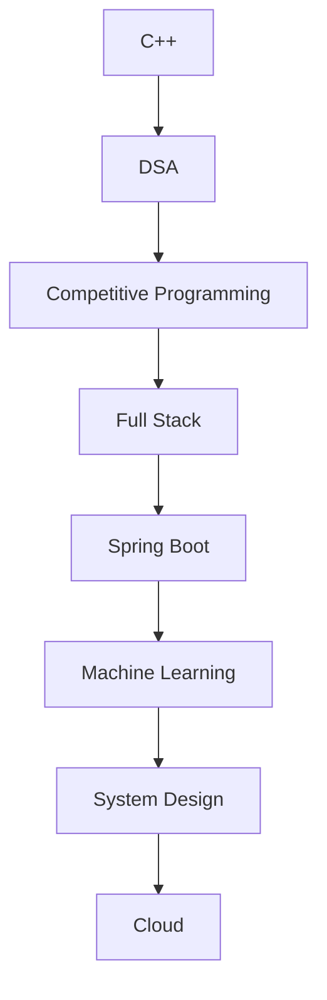

<div align="center">


<br>

<a href="mailto:bhanurjb21@gmail.com">

</a>

<a href="https://linkedin.com/in/bhanurjb">

</a>

<a href="https://github.com/bhanurjb07">

</a>


</div>

---

# 💻 whoami

```bash
> whoami

Bhanu Pratap Singh

Full Stack Developer

Machine Learning Enthusiast

Competitive Programmer

Java Spring Boot Backend Developer

Open Source Contributor

Problem Solver

Coffee → Code → Build → Repeat ☕
```

---

# ⚡ About Me

```cpp
#include<iostream>
#include<vector>
using namespace std;

class Developer{

private:

string name = "Bhanu Pratap Singh";

string role =
"Full Stack Developer";

string backend =
"Node.js + Express + Spring Boot";

string frontend =
"React + Next.js";

string database =
"MongoDB + SQL";

string language =
"C++, Java, JavaScript, Python";

string currentFocus =
"Machine Learning";

vector<string> interests = {

"Competitive Programming",

"Open Source",

"System Design",

"Backend Development",

"Artificial Intelligence"

};

public:

void display(){

cout<<"Build Real Problems"<<endl;

cout<<"Write Clean Code"<<endl;

cout<<"Never Stop Learning"<<endl;

cout<<"Contribute to Open Source"<<endl;

}

};

int main(){

Developer bhanu;

bhanu.display();

}
```

---

# 🚀 Current Mission

- 🌱 Learning **Machine Learning & AI**

- ⚛ Building scalable **MERN Stack Applications**

- ☕ Developing backend using **Java Spring Boot**

- 🏆 Solving Competitive Programming problems daily

- 🌍 Contributing to Open Source

- 📚 Learning System Design

- 💡 Building projects that solve real-world problems

---

# 🛠 Tech Universe

<div align="center">


</div>

---

# 💪 Core Skills

### Frontend

- React.js
- Next.js
- JavaScript
- TypeScript
- HTML5
- CSS3
- Tailwind CSS
- Bootstrap

---

### Backend

- Node.js
- Express.js
- Java Spring Boot
- REST APIs
- JWT Authentication
- MVC Architecture

---

### Database

- MongoDB
- MySQL

---

### Languages

- C++
- Java
- JavaScript
- Python
- SQL

---

### Other

- Git
- GitHub
- VS Code
- Postman
- Docker (Learning)
- Linux

---

# 🧠 Developer Mindset

```text
while(alive){

Learn();

Code();

Debug();

Improve();

Repeat();

}
```

---

# 🎯 2026 Goals

✅ Become an Excellent Full Stack Engineer

⬜ Master Machine Learning

⬜ Crack Top Product Companies

⬜ Become Expert in Spring Boot

⬜ Reach Specialist on Codeforces

⬜ Contribute More to Open Source

⬜ Build SaaS Products

⬜ Learn Cloud Deployment

---

# 💻 Terminal

```bash
bhanu@developer:~$

$ skills

✔ React

✔ Next.js

✔ Node.js

✔ Express.js

✔ Spring Boot

✔ MongoDB

✔ Machine Learning

✔ Competitive Programming

$ status

Coding...
```

---

# 📊 Coding Philosophy

> First solve the problem.

> Then write clean code.

> Then optimize.

> Then automate.

---

# ⚡ Fun Fact

```text
I don't just write code.

I build solutions.

I don't stop until it works.

Then I optimize it.
```

---

## Continue ↓

# 🏆 GitHub Achievements

<div align="center">


</div>

---

# 📊 GitHub Analytics

<div align="center">


</div>

---

# 🔥 GitHub Streak

<div align="center">


</div>

---

# 📈 Contribution Graph

<div align="center">


</div>

---

# 🐍 Contribution Snake

<div align="center">

<picture>

<source media="(prefers-color-scheme: dark)"
srcset="https://raw.githubusercontent.com/bhanurjb07/bhanurjb07/output/github-contribution-grid-snake-dark.svg"/>

<source media="(prefers-color-scheme: light)"
srcset="https://raw.githubusercontent.com/bhanurjb07/bhanurjb07/output/github-contribution-grid-snake.svg"/>


</picture>

</div>

---

# ⚔ Competitive Programming

<div align="center">

### "Every problem solved is another algorithm learned."

</div>

---

## 🏆 Coding Platforms

<div align="center">

<a href="https://codeforces.com/profile/bhanurjb">

</a>

<a href="https://leetcode.com/bhanurjb">

</a>

<a href="https://www.codechef.com/users/bhanurjb">

</a>

</div>

---

## 💻 Coding Stats

```text
Languages

█████████████████████ C++

██████████████████ Java

████████████████ JavaScript

██████████ Python

████████ SQL

```

---

## 📚 Current CP Journey

✔ Daily Problem Solving

✔ Learning Graph Algorithms

✔ Dynamic Programming

✔ Binary Search

✔ Greedy

✔ Trees

✔ Number Theory

✔ STL Mastery

⬜ Segment Tree

⬜ Heavy Light Decomposition

⬜ Advanced Graph Theory

⬜ Geometry

---

# 🚀 Open Source

```text
Status :

🟢 Active Contributor

Programs :

✔ GSSoC

✔ GitHub Community

✔ Open Source Projects

Mission :

Build Projects

Fix Bugs

Help Developers

Write Better Code

```

---

# 🌟 Developer Metrics

```text
Backend Development

███████████████████████ 95%

Frontend Development

████████████████████ 90%

Competitive Programming

█████████████████ 85%

Machine Learning

████████████ 65%

System Design

██████████ 60%

```

---

# 🏅 Current Learning Roadmap



---

# 📈 Growth Timeline

```text

2022

██████ Learned Programming

2023

████████████ C++

████████████ DSA

2024

████████████████ MERN Stack

2025

██████████████████ Spring Boot

████████████████ Open Source

2026

████████████████████ Machine Learning

████████████████████ Competitive Programming

```

---

# ⚡ Developer Dashboard

```bash

Status :

🟢 Online

Location :

India 🇮🇳

Editor :

VS Code

Favourite Language :

C++

Backend :

Spring Boot

Frontend :

React

Database :

MongoDB

Current Focus :

Machine Learning

```

---

# 🎖 Personal Motto

> "Success doesn't come from writing thousands of lines of code.

> It comes from solving thousands of real problems."

---

## NEXT

Part 3 contains

⭐ Featured Projects

🚀 Project Cards

📂 Repository Showcase

🏗 Architecture

💡 What I'm Building

🎯 2026 Roadmap

💼 Experience

📬 Contact Section

🎉 Animated Footer


---

# 🚀 Featured Projects

<div align="center">

*"Turning ideas into scalable and impactful software."*

</div>

---

## 🏥 Clinico — Doctor Appointment Platform


### Overview

A complete healthcare platform where patients can book appointments with doctors, manage schedules, and securely authenticate.

### Features

- 🔐 JWT Authentication
- 👨‍⚕️ Doctor & Patient Dashboards
- 📅 Appointment Booking
- 💳 Online Payment Integration
- 📧 Email Notifications
- ☁️ Cloud Image Upload
- 📱 Responsive UI

### Tech Stack

```
React
Node.js
Express
MongoDB
JWT
Cloudinary
Tailwind CSS
```

---

## 🛒 Flipper — Modern E-Commerce Platform


### Features

- 🛍 Product Catalog
- ❤️ Wishlist
- 🛒 Shopping Cart
- 🔍 Advanced Search
- 📦 Order Tracking
- 👤 User Authentication
- 📱 Mobile Responsive

### Tech Stack

```
React
Express
Node.js
MongoDB
Redux
Tailwind CSS
```

---

## 🤖 Machine Learning Projects

Currently exploring Machine Learning by building practical projects including:

- 📈 House Price Prediction
- 🩺 Disease Prediction
- 📊 Data Analysis
- 🤖 Classification Models
- 📉 Regression Models
- 🧠 Deep Learning (Upcoming)

---

# 🏗 Development Workflow

```text
          Idea

           │

           ▼

      Planning

           │

           ▼

      UI Design

           │

           ▼

 Frontend Development

           │

           ▼

 Backend Development

           │

           ▼

 Database Design

           │

           ▼

 Authentication

           │

           ▼

 Testing

           │

           ▼

 Deployment

```

---

# 💻 Developer Workspace

```yaml
Name: Bhanu Pratap Singh

OS: Windows + Linux

Editor: VS Code

Browser: Chrome

Languages:

- C++
- Java
- JavaScript
- Python

Backend:

- Node.js
- Express.js
- Spring Boot

Frontend:

- React
- Next.js

Database:

- MongoDB
- MySQL

Version Control:

- Git
- GitHub

Current Goal:

Become an Elite Full Stack Developer
```

---

# 📂 Repository Highlights

| Project | Description | Tech |
|----------|-------------|------|
| 🏥 Clinico | Doctor Appointment Platform | MERN |
| 🛒 Flipper | E-Commerce Website | MERN |
| 🤖 ML Projects | Machine Learning Experiments | Python |
| 🌐 Portfolio | Personal Portfolio Website | React |

---

# 🌍 Open Source Journey

```text
Started

      │

      ▼

Learning Git

      │

      ▼

First Pull Request

      │

      ▼

GSSoC Contributor

      │

      ▼

Building Open Source Projects

      │

      ▼

Helping Community

```

---

# 🧠 Problem Solving Mindset

```cpp
while(problem_not_solved){

Think();

Analyze();

Debug();

Optimize();

Repeat();

}
```

---

# 📅 2026 Roadmap

## Quarter 1

- ✅ MERN Stack
- ✅ Authentication
- ✅ REST APIs

---

## Quarter 2

- ☕ Spring Boot
- ☕ Microservices
- ☕ MySQL

---

## Quarter 3

- 🤖 Machine Learning
- 📊 Data Science
- 🧠 Neural Networks

---

## Quarter 4

- ☁️ AWS
- 🐳 Docker
- ☸ Kubernetes
- ⚡ System Design

---

# 💼 What I'm Currently Working On

- 🚀 Building scalable Full Stack Applications

- 🤖 Learning Machine Learning

- ☕ Mastering Java Spring Boot

- 🧩 Solving Competitive Programming Problems

- 🌍 Contributing to Open Source

- 📚 Learning System Design

---

# 📖 My Philosophy

> Code is not just written.

> Code is designed.

> Software is not just built.

> It is engineered.

---

# ⚡ Random Dev Quote

> "The best programmers are not those who know every language,
> but those who never stop learning."

---

# 🎯 Long-Term Vision

```text
Learn

↓

Build

↓

Contribute

↓

Scale

↓

Lead

↓

Inspire

```

---

# 📬 Let's Connect

<div align="center">

<a href="mailto:bhanurjb21@gmail.com">

</a>

<a href="https://github.com/bhanurjb07">

</a>

<a href="https://linkedin.com/in/bhanurjb">

</a>

</div>

---

### ⚡ *"Build something today that your future self will be proud of."*

------

# 📈 Developer Journey

```text
                2022
                  │
                  ▼
         Started Programming
                  │
                  ▼
           Learned C++
                  │
                  ▼
     Data Structures & Algorithms
                  │
                  ▼
      Competitive Programming
                  │
                  ▼
        Full Stack Development
                  │
                  ▼
      Open Source Contributions
                  │
                  ▼
         Java Spring Boot
                  │
                  ▼
         Machine Learning
                  │
                  ▼
      Building Real World Products
```

---

# ⚙️ Developer Environment

```yaml
Name: Bhanu Pratap Singh

Location: India 🇮🇳

Editor:
  - VS Code

Languages:
  - C++
  - Java
  - JavaScript
  - Python
  - SQL

Frontend:
  - React
  - Next.js
  - Tailwind CSS
  - Bootstrap

Backend:
  - Node.js
  - Express.js
  - Spring Boot

Database:
  - MongoDB
  - MySQL

Version Control:
  - Git
  - GitHub

Learning:
  - Machine Learning
  - System Design
  - Cloud
```

---

# 💡 Currently Exploring

- 🤖 Machine Learning
- ☁️ Cloud Computing
- 🏗️ Scalable Backend Architecture
- 🧠 System Design
- ⚡ Performance Optimization
- 🌍 Open Source Contributions

---

# 🧩 Developer Manifesto

```cpp
class Developer {

public:

    void philosophy(){

        while(alive){

            Learn();

            Build();

            Debug();

            Optimize();

            Repeat();

        }

    }

};
```

---

# 🌟 Beyond Coding

When I'm not coding, you'll probably find me:

- 🧩 Solving Competitive Programming problems
- 📖 Learning new technologies
- ☕ Exploring Java & Spring Boot
- 🤖 Reading about AI & Machine Learning
- 🌍 Contributing to Open Source
- 🚀 Building side projects

---

# 📌 Things I Believe In

- 💡 Build projects, not just tutorials.
- 📚 Learn fundamentals before frameworks.
- 🔄 Consistency beats intensity.
- 🤝 Share knowledge with the community.
- 🚀 Never stop improving.

---

# 🎯 5-Year Vision

```text
Today
 │
 ▼
Full Stack Developer
 │
 ▼
Backend Specialist
 │
 ▼
Machine Learning Engineer
 │
 ▼
System Design Expert
 │
 ▼
Software Architect
 │
 ▼
Tech Leader
```

---

# 🌐 Let's Build Something Amazing Together

<div align="center">

### 💬 I'm always open to:

🤝 Open Source Collaboration

💻 Freelance Opportunities

🚀 Startup Projects

📚 Learning Together

☕ Tech Discussions

</div>

---

# 📫 Reach Me

<div align="center">

<a href="mailto:bhanurjb21@gmail.com">

</a>

<a href="https://github.com/bhanurjb07">

</a>

<a href="https://linkedin.com/in/bhanurjb">

</a>

</div>

---

# ❤️ Thanks for Visiting

<div align="center">


<br><br>


</div>

---
